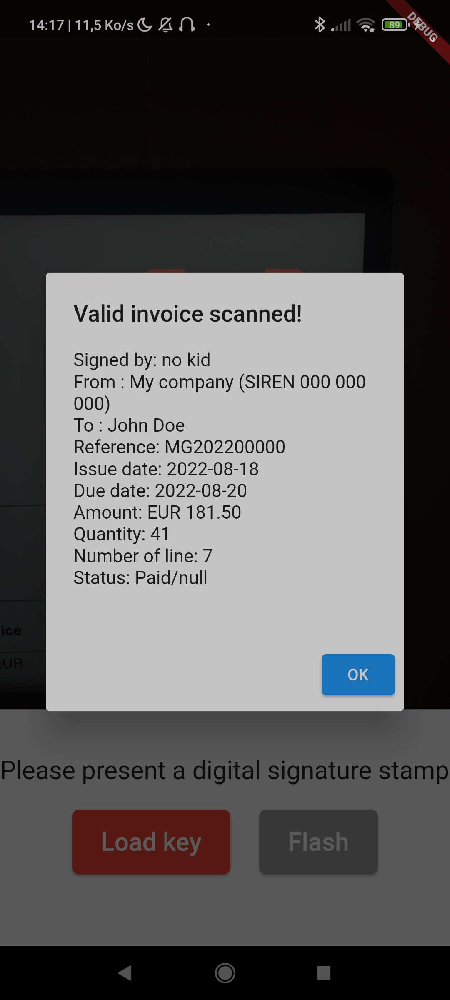

# signed_invoice_verif

The mobile application for verifying invoices generated by the [signed-invoice](https://github.com/maelgangloff/signed-invoice) tool.  
All verification steps are performed on your terminal. No data is transmitted. The application does not need internet.  
The application is still draft, it has no logo, the ergonomics are limited. Feel free to help improve it.

