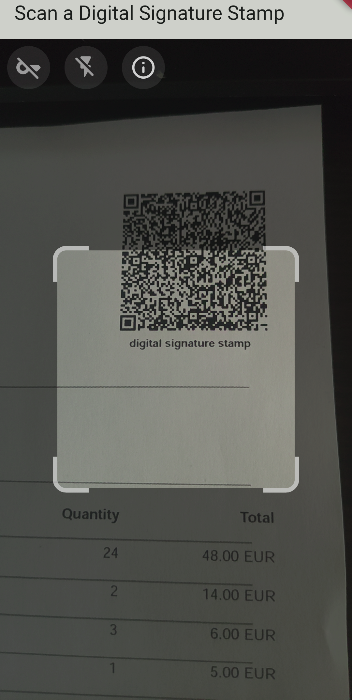

# Invoice Verif

The mobile application for verifying invoices generated by the [signed-invoice](https://github.com/maelgangloff/signed-invoice) tool.  
All verification steps are performed on your terminal. No data is transmitted. The application does not need internet.  
Feel free to improve this app!

## Install
Invoice Verif is available for free on the [Google Play Store](https://play.google.com/store/apps/details?id=fr.maelgangloff.signed_invoice_verif).

## How it works
The application works in two different modes:

- Reading of the invoice without authentication of the cryptographic signature (default mode): The application only reads the contents of the stamp without verifying the signature.

- Verification of the authenticity of the invoice. The application will ask you to select the document issuer's public key file. When a stamp is scanned, the signature is verified. If the signature does not match, an error is thrown and the invoice is marked as not authentic.

